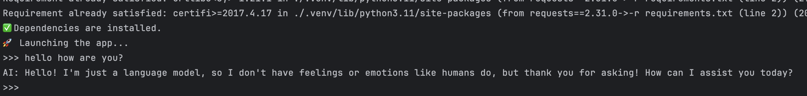

# 🧠 LocaMind

**LocaMind** is a fully local AI assistant powered by open-source LLMs (like LLaMA3 via Ollama). It helps you automate tasks, search files, and interact with your computer — all offline, private, and hackable.

---

## 🚀 Features

- 🧩 Runs on **local LLMs** (no API keys, no cloud)
- 💻 CLI-first interface with optional GUI (Streamlit / Textual)
- 🗂️ File operations (rename, search, organize)
- 🔌 Plugin-ready architecture
- 🛡️ Optional secure mode (confirm risky actions)

---

## 🛠️ Tech Stack

- Python 3.11+
- [Ollama](https://ollama.com) for local model inference
- `make`, `typer`, `requests`, `streamlit`, `textual`, `chromadb`, `langchain`

---

## 📦 Setup 🚀

#### 1. **Clone repo**:

```sh
$ git clone https://github.com/TIP1/LocaMind.git
$ cd LocaMind
```

#### 2. **Install dependencies**:

Project use Python 3.11 and Make for commands management.

OSX:
```sh
$ brew install make  #  Install tool via Homebrew
$ make venv  # create venv
```

Before launching the client (running locally), you need to activate the virtual environment.:

To do this, run the activate command, then copy and run the command from the resulting output:
```sh
$ make activate
🔗 To activate the virtual environment, run the command:
source .venv/bin/activate <-------
ignatylimansky@ LocaMind % source .venv/bin/activate
(.venv) ignatylimansky@ LocaMind % 
```

Now you can install deps:
```sh
$ make install  # install dependencies
```

#### 3. **Run it!**:

```sh
$ make run  # run ai agent
```

Type prompt or "exit" or "quit" for turn it of




